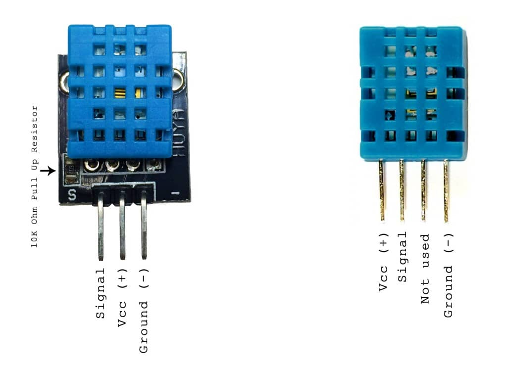
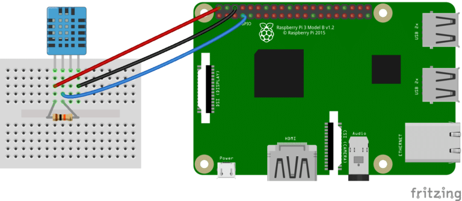

# PIN



# Wiring
  
The resistor is a 5~10K Ohm pull up resistor connected between the Vcc and signal lines.


# Install dependency
```bash
sudo apt-get update
sudo apt-get install python-rpi.gpio 
```

# Run
```bash
pyhton read_dht11.py <pin>
```
Start an endless loop to update data to /tmp/*`pi_dht11_<pin>`*  
Formated as :
```
<Temperature>, <Humidity>, <UTC+0000 in second in epoch>
# for example: 
# 20, 71, 1517138108
```


ref:

* [HOW TO SET UP THE DHT11 HUMIDITY SENSOR ON THE RASPBERRY PI
](http://www.circuitbasics.com/how-to-set-up-the-dht11-humidity-sensor-on-the-raspberry-pi/)
* [DHT11 Python library](https://github.com/szazo/DHT11_Python)

